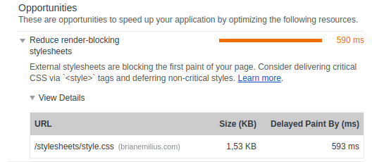

**If you have ever used Google Chrome's Audit tool you've probably noticed that almost no matter what you do Audit will tell you that your CSS is blocking the rendering of your site.**

If you take a look at the report details Google recommends loading critical parts of your styling directly in the `head` section and deferring non-critical styling.



So what is critical styling? What does render-blocking even mean?

When you load a website page with your browser you put it to work. From the server, your browser receives a bunch of HTML, CSS, and in most cases JavaScript. The browser needs to interpret all this code and translate it into something that looks good and is understandable to any regular page-visitor. In other words text, shapes, colours, and animations. This is what we call rendering.

All stylesheets and scripts that you place in the `head` section must first be downloaded and then treated by the browser before the browser can start interpreting what to do and show. This means that any external script or stylesheet is blocking the browser from doing its job quickly - especially on devices with a slow connection.

```HTML
<html>
		<head>
				<title>Slow Website</title>

				<link rel="stylesheet" href="/css/mainstyling.css">
				<link rel="stylesheet" href="/css/fonts.css">
				<link rel="stylesheet" href="/css/fancybox.css">

				<script src="/js/jquery.min.js"></script>
				<script src="/js/app.js"></script>
				<script src="/js/fancybox.js"></script>
				<script src="/js/googleadwords.min.js"></script>
		</head>
		<body>
		<!-- contents that needs to render -->
		</body>
</html>
```

In the above example, 7 external files need to download before the browser can even begin to start rendering. This is what we call *render-blocking*.

Critical styling has to do with how we want our website to look. It has to do with the layout of your site, the most important colours, font faces and font sizes.

## A Solution

I suggest a two-part solution:
* We need to identify what our critical styling is, and
* defer downloading our stylesheets and scripts till after the DOM is loaded.

### Critical Styling

What critical styling is on your website depends entirely on the individual site. You will have to determine how much or how little styling you need for the first rendering. Ask yourself this question: "How little does it take for my site to approximate the look I want?" Then choose the CSS required for this and place it in a `<style>` tag in the `head` section.

```HTML
<html>
    <head>
        <title>A Slightly Faster Website</title>
        <style>
        :root {
            --colorPrimaryForeground: hsl(0, 0%, 7%);
            --colorPrimaryBackground: hsl(0, 0%, 98%);
            --fontStack: Arial, Verdana, sans-serif;
            --fontSize: 1em;
        }
        html, body {
            margin: 0;
            padding: 0;
        }
        body {
            background-color: var(--colorPrimaryBackground);
            color: var(--colorPrimaryForeground);
            font: normal 400 var(--fontSize)/100% var(--fontStack);
        }
        .container {
            display: grid;
            grid-template-columns: repeat(12, minmax(50px, 1fr));
            grid-template-rows: 100px auto 50px;
        }
        </style>
    </head>
    <body>
    <!-- contents that needs to render -->
    </body>
</html>
```

### Defer Downloading Of Non-Critical Styling And Scripts

When the page has rendered and the DOM is loaded we can download the rest of our stylesheets and scripts. JavaScripts are real easy to load in this manner. All you need to do is add the attribute `defer` to the script tag:

```HTML
<script src="/js/jquery.min.js" defer></script>
<script src="/js/app.js" defer></script>
<script src="/js/fancybox.js" defer></script>
<script src="/js/googleadwords.min.js" defer></script>
```

Furthermore, I consider it good praxis to place script tags at the very end of your HTML document right before the `</body>` tag.

Stylesheets are a bit more complicated to handle. We need to write a short JavaScript function that will inject `<link>` tags after the DOM has loaded.

```JavaScript
const cssLoader = function (src) {
    const stylesheet = document.createElement('link');
    stylesheet.href = src;
    stylesheet.rel = 'stylesheet';
    stylesheet.type = 'text/css';
    document.getElementsByTagName('head')[0].appendChild(stylesheet);
};
```

This function can be used inside an event listener:

```JavaScript
document.addEventListener('DOMContentLoaded', () => {
    cssLoader('/css/mainstyling.css');
    cssLoader('/css/fonts.css');
    cssLoader('/css/fancybox.css');
});
```

This makes the entire HTML document look as such:

```HTML
<html>
    <head>
        <title>Much Faster Website</title>
        <style>
        :root {
            --colorPrimaryForeground: hsl(0, 0%, 7%);
            --colorPrimaryBackground: hsl(0, 0%, 98%);
            --fontStack: Arial, Verdana, sans-serif;
            --fontSize: 1em;
        }
        html, body {
            margin: 0;
            padding: 0;
        }
        body {
            background-color: var(--colorPrimaryBackground);
            color: var(--colorPrimaryForeground);
            font: normal 400 var(--fontSize)/100% var(--fontStack);
        }
        .container {
            display: grid;
            grid-template-columns: repeat(12, minmax(50px, 1fr));
            grid-template-rows: 100px auto 50px;
        }
        </style>
    </head>
    <body>

    <!-- contents that needs to render -->
    
    <script src="/js/jquery.min.js" defer></script>
    <script src="/js/app.js" defer></script>
    <script src="/js/fancybox.js" defer></script>
    <script src="/js/googleadwords.min.js" defer></script>
    <script>
    const cssLoader = function (src) {
        const stylesheet = document.createElement('link');
        stylesheet.href = src;
        stylesheet.rel = 'stylesheet';
        stylesheet.type = 'text/css';
        document.getElementsByTagName('head')[0].appendChild(stylesheet);
    };
    document.addEventListener('DOMContentLoaded', () => {
        cssLoader('/css/mainstyling.css');
        cssLoader('/css/fonts.css');
        cssLoader('/css/fancybox.css');
    });
    </script>
    </body>
</html>
```

The only thing we now need to do to perfect this is to make sure the stylesheets are loaded even if the browser has JavaScript switched off.

```HTML
<noscript>
<link rel="stylesheet" href="/css/mainstyling.css">
<link rel="stylesheet" href="/css/fonts.css">
<link rel="stylesheet" href="/css/fancybox.css">
</noscript>
```

Try this method on your next project and see if you can notice whether it makes a difference in your Audit performance report.

I would love to hear from you about your experiences with this method in the commentaries below.