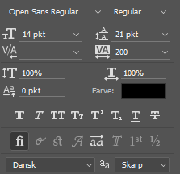

**Hvordan afkoder man de typografiske begreber i Photoshop, så de kan bruges i et stylesheet til hjemmesider?**

Typografi er et utroligt vigtigt designelement, som de fleste integratorer overser, når de konverterer et professionelt Photoshop-design til HTML og CSS. Og det er egentligt ret ærgerligt. Lad os lige se på, hvad der går tabt, når typografi bliver til et overset element:

* Typografi er lige så vigtigt som fx farveskema
* Fejlfortolkede skydninger giver upræcise hjemmesider
* For meget eller for lidt spasiering fører til uhensigtsmæssige linjelængder, samt øget mulighed for fejlagtige fremhævninger
* Det arbejde, designeren har lagt i, at udvælge typer og de valg, der er truffet vedrørende afstande m.m. lige så stor værdi som det arbejde og de overvejelser, der hører til alle de andre elementer i designet.

<!-- more -->

En af de allerstørste udfordringer, der ligger til grund for dette problem, er at Photoshop ikke bruger de samme målenheder, som integratorerne arbejder med.

En god responsiv hjemmeside bruger målenhederne `em` og `%`, blandt andet for at tilgodese muligheden for skærme med forskellige pixeldensiteter - Photoshop bruger punkter, eller `pt`/`pkt` (1 punkt defineres som 1/72 af en tomme). Dertil kommer udfordringen, at browsere kan have forskellige standardindstillinger, alt afhængig af hvem der bruger dem.

Lyder det som noget at få hovedpine af? Det kan jeg godt forstå. Derfor har jeg lavet en guide til omregning af Photoshop-værdier, lige til at benytte i dine stylesheets.

## Spatiering

Lad os starte med det lette. Spatiering er afstanden mellem de enkelte glyffer i skrifttypen.

For lidt spatiering kan knibe tegnene så meget sammen, at ordene bliver svære at læse. På den anden side, kan for meget spatiering gøre, at det bliver svært at se hvad der er ord og hvad der er mellemrum. Begge ting medfører ulæselig tekst.

I Photoshop finder du spatieringen ved at markere noget tekst med tekstværktøjet (T). Når teksten er markeret kan du i dine swatches til højre (alt afhængig af dit foretrukne Photoshop værktøjslinjelayout) finde tegn, afsnit og glyffer:

Som du kan se, er der her valgt en skriftstørrelse på 14 pkt, skydning på 21 pkt og en spatiering på 200 (VA).

Du kan omregne Photoshops spatiering til CSS værdier med følgende formel:

`letter-spacing (i em) = spatiering / 1000`

Det vil sige, at en spatiering på 200 giver følgende resultat:

`0.2em = 200 / 1000`

Eller med andre ord `letter-spacing: 0.2em;`

## Skydning

Ligesom spatiering henviser til den horisontale afstand mellem enkelte tegn, henviser skydning til den vertikale afstand mellem to linjer. Eller sagt mere præcist: Skydning er den vertikale afstand mellem to samhørende linjers grundlinje indenfor den samme skrifttype. CSS-egenskaben for skydning hedder `line-height`.

Du kan udregne skydningen fra Photoshop til CSS med følgende formel:

`line-height (som procentvis sats af den originale skriftstørrelse) = 100 * (skydning / skriftstørrelse)`

Det vil sige, hvis vi bruger eksemplet for oven, har vi en skydning på 21 pkt og en skriftstørrelse på 14 pkt:

`100 * (21 pkt / 14 pkt) = 150% => line-height: 150%;`

## Fremhævning

En skrifttypes fremhævning defineres som tykkelsen på den enkelte glyf, i relativt forhold til glyffets højde. I CSS arbejder vi med mange grader af tykkelse, og de kan angives både med ord (thin, normal, bold) og med en talangivelse fra 100 (tyndest) til 900 (tykkest).

Photoshop angiver fremhævning med ord. Du kan bruge dette skema til at finde den rette tykkelse i CSS:

* font-weight: 100 – Thin
* font-weight: 200 – Extra Light
* font-weight: 300 – Light
* font-weight: 400 – Normal / Regular / Roman / Plain / Book
* font-weight: 500 – Medium
* font-weight: 600 – Semibold / Demi-bold
* font-weight: 700 – Bold
* font-weight: 800 – Heavy
* font-weight: 900 – Black

`font-weight: normal;` er det samme som `font-weight: 400;`