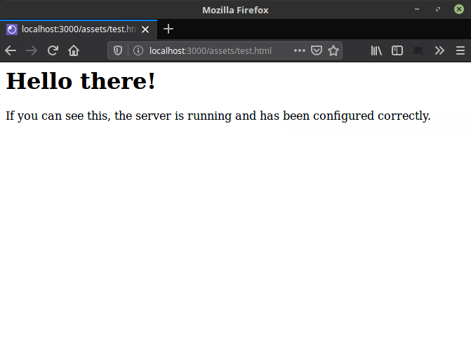

ExpressJS is probably the most popular framework for creating server-side web applications in Node.js.
In this blog series I want to show you how to get started and how to do it The Right Way&trade;.

## Prerequisites

* Basic knowledge of Node.js and npm
* Some intermediate JavaScript knowledge
* Basic HTML and CSS

## Intro

In the previous blog post I introduced you to ExpressJS with a very simple example code.

For this post I want to show you how to build a proper project structure for your ExpressJS application, that will scale and is robust.

The keyword for what I want to do here is "fragmentation". We are going to divide the application into a lot of small, modular files.

The reasoning behind this choice is

* smaller files are easier to maintain
* collaboration runs more smoothly on version control platforms such as GitHub
* you can inject or remove functionality without breaking the application in other places

## The folder structure

Let's start out by taking a look at the folder structure

```
my-express-app/
|   app.js
|   package.json
|
└───node_modules/
|   |   ...
|
└───bin/
|   |   www
|
└───config/
|   |   parsing.js
|   |   view-engine.js
|   |   static-files.js
|   |   database.js
|
└───controllers/
|   |   page.controller.js
|
└───models/
|   |   page.model.js
|
└───views/
|   |   page.ejs
|   |
|   └───partials/
|       |   head.ejs
|       |   seo.ejs
|       |   header.ejs
|       |   footer.ejs
|       |   after-footer.ejs
|
└───routes/
|   |   page.route.js
|   |   router.js
|
assets/
    |   ...
```

### Model, View, Controller

The folders `models`, `views`, and `controllers` are at the very core of the application functionality and is meant to use the programming design pattern "MVC".

### Configuration

In the folder `config` we will keep all the little configuration files that express makes use of. Anything from database setup, which parser to use, or what view engine the application should use.

### The router

I've taken routing logic completely out of the main application file and placed it by itself. As I mention in the previous blog post, I like to keep application configuration and logic separate from the router engine. Basically, the router engine should be able to function on it's own. This is a great pattern for testing purposes, in my opinion.

### www and app.js

The app.js file is the main application file. Here we gather all the threads from the configuration and router. This file is also meant to handle application errors and provide a flow for error pages (for example a 404 page) and error reporting (for example logging).

The www file is the application executable. This file starts the server and handles any server-related errors. We can have several different executables for different situations. An example could be one executable file for development and one for the production environment.

### Static files

Finally, most websites have a bunch of static files that needs to be served so they can be viewed in the browser. These are files such as stylesheets, front-end related JavaScript, images and other media files. These files are kept in the `assets` folder.

## Tie the fragments together

First, let's create the main application file `app.js` with the following code:

```JavaScript
// app.js

let express = require("express");
let app = express();

// Here, we will require the configuration files

module.exports = app;
```

That's it, really. For now. We still need to add requirements for some of our configuration files and the router, but all that comes later. This is the very least we need for the application to run.

The next file we want to create is the `bin/www` executable. There are 3 things we need to do in this file:

* require the application
* create a server instance and make it listen
* handle errors related to the server instance

```JavaScript
// bin/www

#!/usr/bin/env node
let app = require("../app");
let http = require("http");

// Define a port for the server to listen on
let port = process.env.PORT || 3000;
app.set("port", port);

// Create a server instance
let server = http.createServer(app);

// Make the server listen on a port
server.listen(port);

// Handle errors and success
server.on("error", onError);
server.on("listening", onListening);

function pipeOrPort(address) {
	return typeof address == "string" ? `pipe ${address}` : `port ${address.port}`;
}

function onError(error) {
	if (error.syscall != "listen") {
		throw error;
	}

	let bind = pipeOrPort(server.address());

	switch (error.code) {
		case "EACCES":
			console.error(`${bind} requires elevated privileges.`);
			process.exit(1);
			break;
		case "EADDRINUSE":
			console.error(`${bind} is already in use.`);
			process.exit(1);
			break;
		default:
			throw error;
	}
}

function onListening() {
	let bind = pipeOrPort(server.address());
	console.log(`Listening on ${bind}`);
}
```

We start out by requiring the `app` module from app.js as well as the http package, which is a part of the Node.js general API.

```JavaScript
let app = require("../app");
let http = require("http");
```

Next, we define a port for the server to listen on. In this case, the port is set to whatever is in our environment variable `PORT` or, if the environment variable doesn't exist; 3000.

```JavaScript
let port = process.env.PORT || 3000;
app.set("port", port);
```

Then we create a server instance and make it listen on the port.

```JavaScript
let server = http.createServer(app);
server.listen(port);
```

The rest of the file is basic event handling. We set up listeners for 2 events: "error" and "listening".

```JavaScript
server.on("error", onError);
server.on("listening", onListening);
```

If the error event is triggered, we call the function `onError` which handles a few different scenarios, such as 

* the server cannot run because the port we defined is in use by another program
* the server cannot run because the operating system requires certain privileges for a user to run a program

If the listening event is triggered, we log a short message to the console to let us know the server is running.

## Configuration injection

Now that we've got the application and server set up and it's basically ready to run, I want to show you how you can tie in configuration modules. We will be making a single configuration module:

* config for the location of our static files folder

We need two files.

```JavaScript
// config/static-files.js

module.exports = function(express, app) {
	app.use("/assets", express.static("assets"));
};
```

This configuration is a middleware function. It tells express to use a function, `express.static("assets")`, on requests to the "http://localhost:3000/assets" address and serve the folder "assets" as static content to the client.

Basically, this means that when a client navigates to "http://localhost:3000/assets" they have access to anything inside the "assets" folder.

I will dive deeper into what middlewares are in a later article.

Finally, inject this module to our app.js file.

```JavaScript
// app.js

let express = require("express");
let app = express();

// Here, we will require the configuration files
require("./config/static-files")(express, app);

module.exports = app;
```

## Test all the things!

Now it's time to see if all we did actually works. To test the server, I want to have a HTML file in the assets folder, that prints out a simple message, so I can see that everything runs correctly so far.

```html
<!-- assets/test.html -->

<h1>Hello there!</h1>
<p>If you can see this, the server is running and has been configured correctly.</p>
```

Now save the file and run the server from your console with the command

```bash
node bin/www
```

You should see the message

```bash
Listening on port 3000
```

Then open your browser and navigate to `http://localhost:3000/assets/test.html`.

You should see this:



If you have followed along so far, I would really love your input. Are the concepts I demonstrate easy to understand or is there something you wish I explain more clearly?

I have prepared [a small repository on GitHub](https://github.com/brians-open-source-stuff/express-tutorial), that you can clone and play around with. It contains everything covered in this post.

The next article will be about the router.

Articles in this series so far

* [Get Started With ExpressJS](https://www.brianemilius.com/get-started-with-expressjs/)
* [ExpressJS Project Structure](https://www.brianemilius.com/expressjs-structure/)

Upcomming articles:

* The ExpressJS Router
* ExpressJS Template Engines
* ExpressJS Middleware
* How To Parse Content From Forms With ExpressJS

---
<a href="https://www.freepik.com/free-photos-vectors/people">Construction photo created by jcomp - www.freepik.com</a>