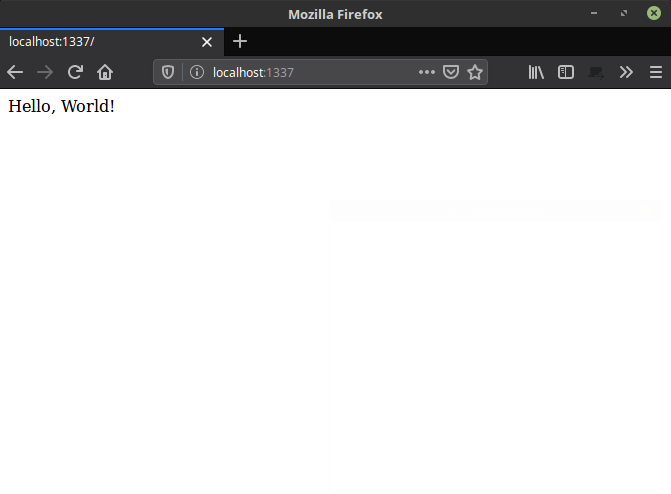

ExpressJS is probably the most popular framework for creating server-side web applications in Node.js.
In this blog series I want to show you how to get started and how to do it The Right Way&trade;.

## Prerequisites

* Basic knowledge of Node.js and npm
* Some intermediate JavaScript knowledge
* Basic HTML and CSS

## Intro

First things first. Before I throw you into a lot of little code snippets and techy-talk, let's have a look at what is a server-side web application.

Basically, we have two kinds of web applications that differ majorly: Server-side and Client-side.

On the client-side, the usual case is, that a browser receives a scaffold HTML page from the server. It then queries the server for data and then renders the data into the HTML scaffold. We call this client-side-rendering (CSR for short).

This use-case is very popular (in 2019) and you see it on a lot of big company websites such as Facebook or Youtube.

Two of the reasons for the popularity of this method are performance and maintenance. Servers perform better, if they have to do less work with every request. This also means that maintaining a server environment is a lot easier (and, importantly, a lot cheaper).

The downside of methods like this is that we put a lot of the work on client devices. This means that phones or laptops drain their battery faster, and data plans gets used up quicker.

On the flip-side is server-side-rendering (SSR for short).

SSR is a method, where the server receives a request for a webpage. It then gathers all the data it needs to put together a HTML-page, renders the page, and then ships it off to the client.

This method leaves almost all the hard work to the server, and not the client device. The downside here is that the server actually has to do some work for every request. The more requests your web-application gets, the harder the server has to work.

## Now let's dive in

To begin with we need to initialize an NPM project and install the ExpressJS package. Create a new folder somewhere on your computer. This folder is our root.

```bash
mkdir my-express-app
cd my-express-app
npm init -y && npm i express
```

Let's create an app.js file in the root folder and enter this code.

```JavaScript
// app.js

let express = require("express");
let app = express();
let Router = express.Router();

Router.get("/", function routerCallback(request, response) {
	response.send("Hello, World!");
});

app.use(Router);

app.listen(1337, function server(err) {
	if (err) {
		console.log(error);
		process.exit(1);
	}
	console.log("Server is listening on port 1337");
});
```

### Standard configuration

First, we require the express library. This is needed for the entire application to function at all.

Then we invoke the express library and put it in a variable named `app`.

We also need to invoke the `Router` function from express.

These 3 items are the core of the application. We could choose not to use the Router function, but in this example I am using it because I like to separate application configuration and logic from the router engine.

### Routing

The next thing in the application is the route. We create a listener for the endpoint "/", which is the root of our homepage (the "frontpage").

```JavaScript
Router.get("/", function routerCallback(request, response) {
	response.send("Hello, World!");
});
```

The listener listens for any requests to the endpoint with the HTTP method GET. If a client makes a GET request to the endpoint address, the callback function is triggered. I've put a very short example of how to make something appear on your website. This one renders ye olde "Hello, World!" message.

Once we've written all our route functions (yes, we can have as many as we want), we need to tell the application to use the Router.

```JavaScript
app.use(Router);
```

### Starting the server

Lastly we start the server by telling our app to listen on a port. In this example I use port 1337 but in reality you could use any non-reserved port. A common port to use with express applications is 3000.

```JavaScript
app.listen(1337, function server(err) {
	if (err) {
		console.log(error);
		process.exit(1);
	}
	console.log("Server is listening on port 1337");
});
```

## Start the application and test it

Once we've saved the `app.js` file we can run the application and test it. To run it, type this in your console.

```bash
node app
```

It should give you the message

```bash
Server is listening on port 1337
```

Now you can open the website in a browser by navigating to this address: http://localhost:1337/.

This is what you should see:



To stop the application, click `CTRL`+`C` in your console.

This is the very basics of getting started with ExpressJS. In the next blog-post I will write a bit about the structure of an express application.

Let me know in the comments if you followed along and how it worked out for you.

---

<a href="https://www.freepik.com/free-photos-vectors/technology">Technology vector image created by slidesgo - www.freepik.com</a>