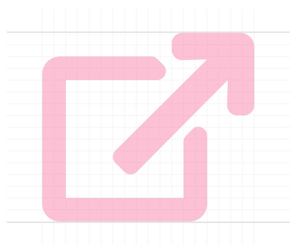

Meget kan siges om links, der åbner et nyt vindue eller faneblad. Hvor vidt det er en god idé eller best practice at gøre sådan er ikke det denne artikel handler om. Derimod vil jeg rigtig gerne diskutere, hvad vi kan gøre i de tilfælde, hvor det alligevel er nødvendigt at åbne et nyt vindue eller faneblad.

Du kender helt sikkert denne form for link:

```html
<a href="http://hjemmeside.dk/index.html" target="_blank" rel="noopener">En hjemmeside</a>
```

Når du klikker på et sådant link, vil linkets sti blive åbnet i et nyt vindue eller et nyt faneblad, alt afhængig af, hvordan den enkelte browser er indstillet. I dag er de fleste browsere indstillet til at åbne et faneblad.

Fordi vi allerhelst gerne vil lade linkets opførsel være op til den enkelte bruger, kan det være irriterende, hvis et link ikke opfører sig sådan som brugeren forventer. Hvis brugeren for eksempel forventer at det link hun klikker på, åbner i samme faneblad og der sker noget helt anden, giver det anledning til frustration, irritation, og i værste tilfælde, at brugeren holder op med at benytte vores app eller site.

<!-- more -->

Derfor mener jeg det er en rigtig god idé at gøre vores brugere opmærksomme på, hvordan de kan forvente at bestemte funktioner i en app eller på en hjemmeside opfører sig - herunder, i særlig grad, links der åbnes under et nyt faneblad.

Der er 2 hensyn vi kan vælg at tage
* visuelt
* WAI-AIRA

## Den visuelle metode
Den klart letteste måde at gøre en bruger opmærksom på, at et link åbner en ekstern side under et nyt faneblad, er ved at give dem et visuelt hint.

Jeg er glad for ikoner og bruger dem til netop dette, der hvor det giver mening. Et rimelig kendt ikon til dette formål er [font awesome ikonet `external-link`](https://fontawesome.com/icons/external-link?style=solid).



For at indsætte dette ikon lige efter et link der har attributten `target="_blank"`, kan vi gøre følgende i CSS:

```css
a[target="_blank"]::after {
	font-family: FontAwesome;
	content: ' \f08e';
}
```

Dette giver vores bruger et rimeligt let genkendeligt visuelt hint, der lader dem vide hvad de kan forvente, når de klikker på linket.
Der er blot ét lille problem med denne metode: Blinde og svagtseende, samt andre der bruger skærmoplæsere "ser" ikke dette ikon. Det bringer os til det andet hensyn vi kan tage.

## WAI-ARIA
WAI-ARIA[^1] specifikationen skal hjælpe os udviklere med at gøre applikationer og hjemmesider let-tilgængelige for brugere med begrænsninger. Herunder hører blandt andet blinde, svagtseende og ordblinde. Denne gruppe brugere benytter sig af skærmoplæsere til at navigere og "se" en hjemmeside.

Specifikationen indeholder en attribut, som er relevant i denne sammenhæng: `aria-describedby`. Ved at bruge denne attribut på vores links, vil en bruger med skærmoplæser få læst en ekstra lille stump tekst op, som beskriver linket.

Først laver vi en container, der indeholder vores beskrivelser. Læg mærke til at containeren har attributten `hidden`, så den ikke bliver vist på siden, eller bliver indkluderet i en skærmoplæsers flow.

```html
<div hidden>
	<span id="link-description-0">Åbner en ekstern side</span>
	<span id="link-description-1">Åbner en ekstern side i et nyt vindue</span>
</div>
```

Nu kan vi henvise til disse beskrivelser i vores links med `aria-describedby`-attributten.

```html
<a href="http://hjemmeside.dk/index.html" target="_blank" rel="noopener" aria-describedby="link-description-1">En hjemmeside</a>
```

Skærmoplæsere vil læse ovenstående link som "Link: En hjemmeside [kort pause] Åbner en ekstern side i et nyt vindue".

Hvad mener du om denne metode? Jeg kunne rigtig godt tænke mig at få dit input om brugeroplevelsen i forbindelse med eksterne links i kommentarsektionen herunder.

[^1]: https://www.w3.org/WAI/intro/aria