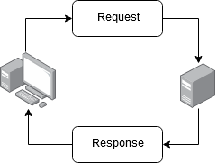

ExpressJS is probably the most popular framework for creating server-side web applications in Node.js.
In this blog series I want to show you how to get started and how to do it The Right Way&trade;.

Articles in this series so far

* [Get Started With ExpressJS](https://www.brianemilius.com/get-started-with-expressjs/)
* [ExpressJS Project Structure](https://www.brianemilius.com/expressjs-structure/)
* [The ExpressJS Router]()

Upcomming articles:

* ExpressJS Template Engines
* ExpressJS Middleware
* How To Parse Content From Forms With ExpressJS

## Prerequisites

* Basic knowledge of Node.js and npm
* Some intermediate JavaScript knowledge
* Basic HTML and CSS
* It's a good idea to have read the previous posts in this series.

## Intro

I've written about the very basics of ExpressJS and how to build a solid project structure that scales. In this article we'll take a look at the Router and what we can do with it.

## What Even Is Routing?

The basic idea of routing in web applications is to make sure a request is directed to the correct resource and the correct functionality.

Any request to a web application is made with the [HTTP-protocol](https://en.wikipedia.org/wiki/Hypertext_Transfer_Protocol).

When a server receives a HTTP request from a client it looks at the `path`, the `query`, and the `fragment` part of the request, as well as the HTTP method with which the request was made.

The server then decides what to do with this request - how to treat it. This is what the router does.

Once the router has delegated the request to the proper resource, the server sends a response back to the client.



## The Express Router

This brings us to the router functionality in Express. A very basic router function could look something like this:

```javascript
router.get("/profile", function(request, response) {
	// ... treat the request
	response.send("Welcome to your profile"); // send a response
});
```

Let's break this down.

`router.get` determines which [HTTP method](https://developer.mozilla.org/en-US/docs/Web/HTTP/Methods) the router should capture. HTTP methods are a part of the HTTP specification and is meant to convey what a request wishes to do:

* `GET` is for retrieving a resource. Every time you enter a URL in your browser and hit enter you effectively create a `GET` request. This is the most common method.
* `POST` is for creating a resource.
* `DELETE` is for deleting a resource.
* `PUT` and `PATCH` are for updating resources, but they do it diffently from each other; `PUT` replaces the resource to be updated entirely, while `PATCH` updates only parts of the resource to be updated.

You know two of these methods from HTML-forms.

Next is `"/profile"`. This is the HTTP request path, query, and fragment part. Here we tell the router which "resource" on the server the router should work for. There are several things we can do with this, which I will get into later in this article. The path basically means that we can type in `http://mydomain.com/profile` in the browser, and this will trigger the above router function.

Lastly, the callback function:

```javascript
function(request, response) {
	// ... code
}
```

This is what is called a middleware function in the Express framework. It takes as a minimum 2 arguments; Request, and Response.

Requests and responses always contain a header and a body. The header deals with meta information about the request or response, and the body is the actual contents of the request or the response.

The Request object contains all relevant information about the request, and the Response object the same, but for the response.

You can `console.log` the two to see exactly what they contain.

## What We Can do With The Router

The router function is a very flexible tool that lets you capture requests to the server, to server resources, and it can sort through the HTTP request methods used - as I explained above. But we can digest requests even further, looking at pre-defined parameters or query strings.

### Parameters

```javascript
app.get("/product/:id", function(request, response) {
	response.send("You requested a product with the ID: " + request.params.id);
});
```

A parameter is defined in the route resource string with a colon prefix `:id`. You can reference it inside your router callback function in the request object.

If there are any parameters defined, the request object will have an object named `params`.

This means, that if you defined a paramter as `:id`, you can access it with `request.params.id`.

### Query Strings

Query strings are often used to add modifications to a resource request. A very common use-case is pagination:

```javascript
app.get("/products?page=2", function(request, response) {
	response.send("You requested to see page: " + request.query.page);
});
```

As with parameters, query strings are defined in the route resource string as you would a common query string `?page=1`. If you need more query string variables you can separate them with a & `?page=1&limit=10`.

And, as with parameters, you can access the query string variables in the request object `request.query.page` and `request.query.limit`.

### What Is The Difference?

Well, I would say parameters are used for making pretty URLs, such as `https://mywebsite.com/products/42`, and query string variables should be used for search strings, and modifications such as page number, limits, language localization, etc.

### RegExp

You can even define your route resource string as a regular expression!

```javascript
app.get(/a/, function(request, response) {
	// treat the request ...
	response.send("This route captures all resources that has an 'a' in it.");
});
```

## Middleware

Remember how I said that the router callback function is what we call a middleware function in Express?

A middleware function is basically a function that can access the request and respnse object. But there is one more, which is important to know about: `next`.

A true Express middleware function has all 3 objects as parameters:

```javascript
function myMiddlewareFunction(request, response, next) {
	// treat the request ...
	// ...
	// provide either a
	response.send("Hello, World!");
	// or a 
	next();
}
```

The `response.send()` method sends headers and a response body to the client. This basically ends the response, and no more headers can be sent after this.

But if we instead use the `next()` callback function, we send the request on to the _next_ middleware function down the line.

What does this mean? Well, you can, in fact, have as many middleware functions in a route as you wish.

```javascript
function myFirstMiddleware(request, response, next) {
	if (request.headers.authorization !== "Bearer 123456789") {
		response.status(401);
		response.send("You are not allowed to view this page.");
		return;
	}
	next();
}

function mySecondMiddleware(request, response, next) {
	response.send("Hello, and welcome to the secret page.");
}

app.get("/secret", myFirstMiddleware, mySecondMiddleware);
```

In the above example, two middleware functions are defined. The first one makes a check on the request header to see if it includes an authorization header with a correct Bearer token. If it does not, the middleware replies with a status code 401 (unauthorized) and a message.

Otherwise, the first middleware sends the request on to the next middleware, which shows a secret page.

You can write your own middleware functions like this - but there are also a vast library of middleware functions on open source platforms such as npm.

Read more about the Express Router on the [Express website documentation](https://expressjs.com/en/guide/routing.html).

---

Cover image by [www.freepik.com](https://www.freepik.com/free-photos-vectors/design).